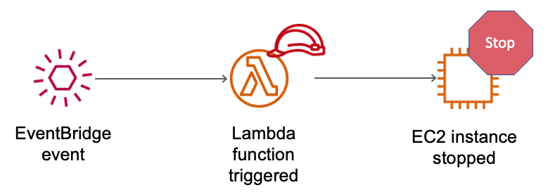
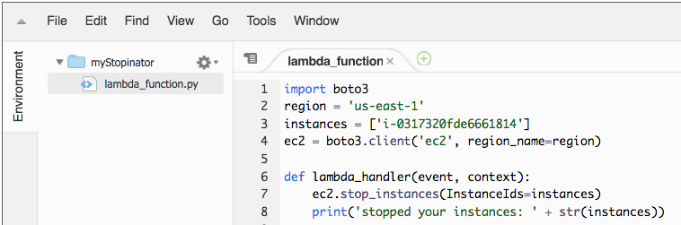

# Activity: AWS Lambda
## Lab overview


 

In this hands-on activity, you will create an AWS Lambda function. You will also create an Amazon EventBridge event to trigger the function every minute. The function uses an AWS Identity and Access Management (IAM) role. This IAM role allows the function to stop an Amazon Elastic Compute Cloud (Amazon EC2) instance that is running in the Amazon Web Services (AWS) account.

## Duration
This activity takes approximately __30 minutes__ to complete.

## AWS service restrictions
In this lab environment, access to AWS services and service actions might be restricted to the ones that are needed to complete the lab instructions. You might encounter errors if you attempt to access other services or perform actions beyond the ones that are described in this lab.

## Accessing the AWS Management Console

1. At the top of these instructions, choose  Start Lab.

   * The lab session starts.

   * A timer displays at the top of the page and shows the time remaining in the session.

   * __Tip:__ To refresh the session length at any time, choose  __Start Lab__ again before the timer reaches 0:00.

   * Before you continue, wait until the circle icon to the right of the AWS  link in the upper-left corner turns green. 

2. To connect to the AWS Management Console, choose the __AWS__ link in the upper-left corner.

   * A new browser tab opens and connects you to the console.

     __Tip:__ If a new browser tab does not open, a banner or icon is usually at the top of your browser with the message that your browser is preventing the site from opening pop-up windows. Choose the banner or icon, and then choose __Allow pop-ups__.

3. Arrange the AWS Management Console tab so that it displays along side these instructions. Ideally, you will be able to see both browser tabs at the same time, to make it easier to follow the lab steps.

## Getting Credit for your work

At the end of this lab you will be instructed to submit the lab to receive a score based on your progress.

__Tip:__ The script that checks you works may only award points if you name resources and set configurations as specified. In particular, values in these instructions that appear in This Format should be entered exactly as documented (case-sensitive).


## Task 1: Create a Lambda function

4. In the search box to the right of __Services__, search for and choose __Lambda__ to open the AWS Lambda console.

5. Choose __Create a function__.

6. In the __Create function__ screen, configure these settings:

   * Choose __Author from scratch__

   * Function name: myStopinator

   * Runtime: __Python 3.11__

   * Choose __Change default execution role__

   * Execution role: __Use an existing role__

   * Existing role: From the dropdown list, choose __myStopinatorRole__

7. Choose __Create function__.
 

## Task 2: Configure the trigger

In this task, you will configure a scheduled event to trigger the Lambda function by setting an Amazon EventBridge event as the event source (or trigger). The Lambda function can be configured to operate much like a cron job on a Linux server, or a scheduled task on a Microsoft Windows server. However, you do not need to have a server running to host it.

8. Choose __Add trigger__.

9. Choose the __Select a trigger__ dropdown menu, and select __EventBridge (CloudWatch Events)__.

10. For the rule, choose __Create a new rule__ and configure these settings:

    * Rule name: everyMinute

    * Rule type: __Schedule expression__

    * Schedule expression: rate(1 minute)

    __Note:__ A more realistic, schedule-based stopinator Lambda function would probably be triggered by using a cron expression instead of a rate expression. However, for the purposes of this activity, using a rate expression ensures that the Lambda function will be triggered soon enough that you can see the results.

11. Choose __Add__.


## Task 3: Configure the Lambda function
In this task, you will paste a few lines of code to update two values in the function code. You do not need to write code to complete this task.

12. Below the __Function overview__ pane, choose __Code__, and then choose lambda_function.py to display and edit the Lambda function code. 

13. In the __Code source__ pane, delete the existing code. Copy the following code, and paste it in the box:

    ```python
    import boto3
    region = '<REPLACE_WITH_REGION>'
    instances = ['<REPLACE_WITH_INSTANCE_ID>']
    ec2 = boto3.client('ec2', region_name=region)
    
    def lambda_handler(event, context):
    ec2.stop_instances(InstanceIds=instances)
    print('stopped your instances: ' + str(instances))
    ```

    __Note:__ After pasting the code into the __Code source__ box, review line 5. If a period (.) was added, delete it.

14. Replace the <REPLACE_WITH_REGION> placeholder with the actual Region that you are using. To do this:

    Choose on the region on the top right corner and use the region code. For example, the region code for US East (N. Virginia) is us-east-1.

    __Important:__ Keep the single quotation marks (' ') around the Region in your code. For example, for the N. Virginia, it would be 'us-east-1'

15. __Challenge section__: Verify that an EC2 instance named instance1 is running in your account, and copy the instance1 __instance ID__.  

    You are encouraged to figure out how to do this task without specific step-by-step guidance. However, if you need detailed guidance, select this text to reveal detailed steps:
 
16. Return to the __AWS Lambda console__ browser tab, and replace <REPLACE_WITH_INSTANCE_ID> with the actual instance ID that you just copied.

    __Important__: Keep the single quotation marks (' ') around the instance ID in your code.

    Your code should now look similar to the following example. However, you might have a different value for the Region, and you will have a different value for the instance ID:

    

17. Choose the __File__ menu and __Save__ the changes. Then, in the __Code source__ box, choose __Deploy__.

    Your Lambda function is now fully configured. It should attempt to stop your instance every minute.

18. Choose __Monitor__ (the tab near the top of the page).

    Note that one of the charts shows you how many times your function has been invoked. There is also a chart that shows the error count and the success rate as a percentage.


## Task 4: Verify that the Lambda function worked

19. Return to the __Amazon EC2 console__ browser tab and see if your instance was stopped.

    __Tip:__ You can choose the  refresh icon or refresh the browser page to see the change in state more quickly.

20. Try starting the instance again. What do you think will happen?

    Choose __here__ to reveal the answer.
 

## Submitting your work

21. To record your progress, choose __Submit__ at the top of these instructions.

22. When prompted, choose __Yes__.

    After a couple of minutes, the grades panel appears and shows you how many points you earned for each task. If the results don't display after a couple of minutes, choose __Grades__ at the top of these instructions.

    __Important__:  Some of the checks made by the submission process in this lab will only give you credit if it has been at least 5 minutes since you completed the action. If you do not receive credit the first time you submit, you may need to wait a couple minutes and the submit again to receive credit for these items. 

    __Tip__: You can submit your work multiple times. After you change your work, choose __Submit__ again. Your last submission is recorded for this lab.

23. To find detailed feedback about your work, choose __Submission Report__.

    __Tip:__ For any checks where you did not receive full points, there are sometimes helpful details provided in the submission report.


## Activity complete

Congratulations! You have completed the activity.

24. Choose End Lab at the top of this page, and then to confirm that you want to end the activity, choose Yes.  

    A panel appears, with a message that indicates: DELETE has been initiated... You may close this message box now.

25. To close the panel, go to the top-right corner and choose the __X__.


© 2023 Amazon Web Services, Inc. and its affiliates. All rights reserved. This work may not be reproduced or redistributed, in whole or in part, without prior written permission from Amazon Web Services, Inc. Commercial copying, lending, or selling is prohibited.