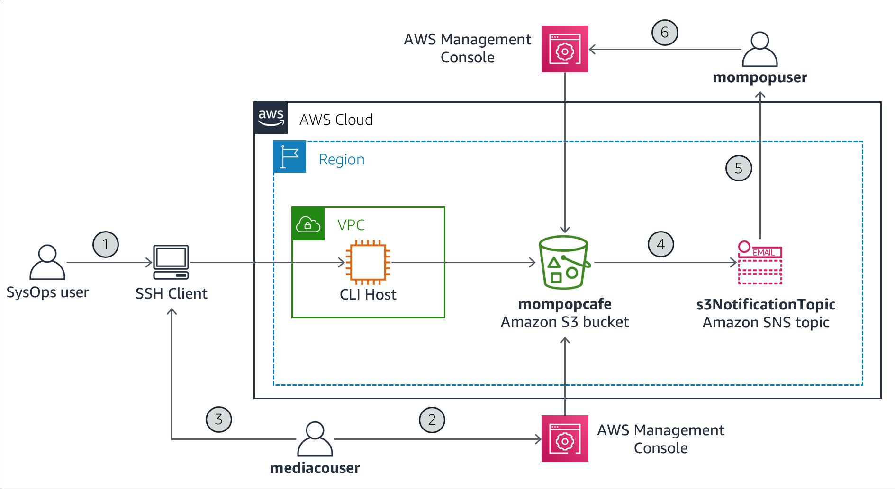

# Module 8: Activity 8 - Work with Amazon S3
 
## Activity overview

In this activity, you create and configure an Amazon S3 bucket to share images between a Mom & Pop Café user (mompopuser) and an external media company user (mediacouser) that was hired to provide pictures of the products sold by the Café. You also configure the S3 bucket to automatically generate an email notification to the Café user when the bucket contents are modified.

This diagram shows the component architecture of the Amazon S3 file-sharing solution and illustrates its usage flow, which consists of the following steps:

__Amazon S3 share bucket architecture diagram:__




1. The systems operator at Mom & Pop Café creates and configures an Amazon S3 bucket named mompopcafe as a container for sharing images. An AWS Identity and Access Manager (IAM) user named mediacouser has been pre-created with appropriate S3 permissions to allow a user from the external media company to add, change, or delete images from the bucket. Another IAM user named mompopuser has also been pre-created to allow Mom or Pop to view the contents of the bucket when they receive a notification. The necessary S3 permissions are reviewed for each user to make sure that access to the bucket is secure and appropriate for each role.

2. When new product pictures are available or when existing pictures must be updated, a representative from the media company logs in to the AWS Management Console as mediacouser to upload, change, or delete the bucket contents.

3. As an alternative, the mediacouser can use the AWS Command Line Interface (AWS CLI) to manipulate the contents of the S3 bucket.

4. When Amazon S3 detects a change in the bucket’s contents, it publishes a notification to the _s3NotificationTopic_ Amazon Simple Notification Service (Amazon SNS) topic.

5. The mompopuser, who is subscribed to the __s3NotificationTopic__, receives an email message that contains the details of the changes to the bucket’s contents.

6. The mompopuser then logs in to the AWS Management Console to view the newly uploaded images or the results of the changes to the bucket's contents.
 

## Activity objectives

After completing this activity, you will be able to:

* __Use__ the s3api and s3 AWS CLI commands to create and configure an Amazon S3 bucket.

* __Configure__ an Amazon S3 bucket for file sharing with an external user.

* __Secure__ an Amazon S3 bucket for different access requirements by using Amazon S3 permissions.

* __Configure__ event notification on an Amazon S3 bucket.
 
 
## Business case relevance
__A new business requirement for Mom & Pop Café—Share files with an external partner__


Pop has been experimenting with new recipes and has started to expand the Café's product list. He wants to add these new products to the online menu on the Café's website. He has hired an external media company to create a portfolio of pictures that showcase the new products.

Pop wants to receive the pictures from the media company electronically in one convenient and secure location. He also wants to be notified by email when pictures are uploaded so that he can approve them before they are deployed to the website. Pop asks Sophie to consult with the AWS team for a recommended solution.

Natalia, an AWS developer, suggests using Amazon S3 to share files with the external partner.

In this activity, you will take on the role of Sophie, and implement the Amazon S3 file-sharing solution. You will also take on the roles of Pop and the media company user to test and validate the Amazon S3 usage scenario.

 
## Activity steps

__Duration:__ This activity requires approximately __90 minutes__ to complete.

 
## Launching the activity environment

7. At the top of these instructions, choose Start Lab to launch your lab.

   A Start Lab panel opens displaying the lab status.

8. Wait until you see the message "__Lab status: ready__", then choose the X to close the Start Lab panel.

9. At the top of these instructions, choose AWS

   This will open the AWS Management Console in a new browser tab. The system will automatically log you in.

   __Tip:__ If a new browser tab does not open, there will typically be a banner or icon at the top of your browser indicating that your browser is preventing the site from opening pop-up windows. Choose the banner or icon and choose "Allow pop ups."

10. Arrange the AWS Management Console tab so that it displays along side these instructions. Ideally, you will be able to see both browser tabs at the same time, to make it easier to follow the lab steps.

 
## Task 1: Connect to the AWS CLI Host instance by using SSH

Begin by opening a Secure Shell (SSH) session to the __CLI Host__ instance that is provided in your lab environment. You will be using the AWS CLI to create the Amazon S3 bucket and to perform most of the bucket configuration actions that are required in this activity.

If you are a Windows user, follow the steps described in Task 1.1. Otherwise, if you are a macOS or Linux user, follow the steps in Task 1.2.


### Task 1.1: Windows SSH

These instructions are for Windows users only.

If you are using macOS or Linux, [skip to the next section](https://labs.vocareum.com/web/3624801/3529073.0/ASNLIB/public/docs/lang/en_us/README.html?vockey=6bd3c53182a5e35791a5a4d91f10a263b11a6487fe040a25199cb4c4287163c6#ssh-MACLinux).

11. Read through the three bullet points in this step before you start to complete the actions, because you will not be able see these instructions when the Details panel is open.

    * Choose the Details drop down menu above these instructions you are currently reading, and then choose Show. A Credentials window will open.

    * Choose the __Download PPK__ button and save the __labsuser.ppk__ file. Typically your browser will save it to the Downloads directory.

    * Then exit the Details panel by choosing on the __X__.

12. Download needed software.

    * You will use __PuTTY__ to SSH to Amazon EC2 instances. If you do not have PuTTY installed on your computer, [download it here](https://the.earth.li/~sgtatham/putty/latest/w64/putty.exe).

13. Open __putty.exe__

14. Configure PuTTY to not timeout:

    * Choose __Connection__
    
    * Set __Seconds between keepalives__ to 30
    
    This allows you to keep the PuTTY session open for a longer period of time.

15. Configure your PuTTY session:

    * Choose __Session__

    * __Host Name (or IP address)__: Paste the Public DNS or IPv4 address of the Bastion Host instance that you noted earlier. 

    * Back in PuTTY, in the __Connection__ list, expand  __SSH__

    * Choose __Auth__ and expand  __Credentials__

    * Under __Private key file for authentication:__ Choose __Browse__

    * Browse to the labsuser.ppk file that you downloaded, select it, and choose __Open__

    * Choose __Open__ again

16. To trust and connect to the host, choose __Accept__.

17. When prompted __login as__, enter: ec2-user

    This will connect you to the EC2 instance.

18. [Windows Users: Choose here to skip ahead to the next task](https://labs.vocareum.com/web/3624801/3529073.0/ASNLIB/public/docs/lang/en_us/README.html?vockey=6bd3c53182a5e35791a5a4d91f10a263b11a6487fe040a25199cb4c4287163c6#ssh-after).


### Task 1.2: macOS/Linux SSH

These instructions are for Mac/Linux users only. If you are a Windows user, [skip ahead to the next task](https://labs.vocareum.com/web/3624801/3529073.0/ASNLIB/public/docs/lang/en_us/README.html?vockey=6bd3c53182a5e35791a5a4d91f10a263b11a6487fe040a25199cb4c4287163c6#ssh-after).

19. Read through the three bullet points in this step before you start to complete the actions, because you will not be able see these instructions when the Details panel is open.

    * Choose the Details drop down menu above these instructions you are currently reading, and then choose Show. A Credentials window will open.

    * Choose the __Download PEM__ button and save the __labsuser.pem__ file.

    * Then exit the Details panel by choosing the __X__.

20. Open a terminal window, and change directory cd to the directory where the labsuser.pem file was downloaded.

    For example, run this command, if it was saved to your Downloads directory:

    ```bash
    cd ~/Downloads
    ```

21. Change the permissions on the key to be read only, by running this command:

    ```bash
    chmod 400 labsuser.pem
    ```

22. Return to the AWS Management Console, and in the EC2 console, choose __Instances__. Check the box next to the CLI Host instance.

23. In the Description tab, copy the __Public IPv4 address__ value.

24. Return to the terminal window and run this command (replace <__public-ip__> with the actual public IP address you copied):

    ```bash
    ssh -i labsuser.pem ec2-user@<public-ip>
    ```

25. Type yes when prompted to allow a first connection to this remote SSH server.

    Because you are using a key pair for authentication, you will not be prompted for a password.


### Task 1.2: Configure the AWS CLI on the CLI Host EC2 Instance

26. Discover the region in which the CLI Host instance is running:

    ```bash
    curl http://169.254.169.254/latest/dynamic/instance-identity/document | grep region
    ```

    You will use this region information in a moment.

27. Update the AWS CLI software with the credentials.

    ```bash
    aws configure
    ```

28. At the prompts, enter the following information:

    * __AWS Access Key ID__: Choose the Details drop down menu above these instructions, and then choose Show. Copy the __AccessKey__ value and paste it into the terminal window.

    * __AWS Secret Access Key__: Copy and paste the __SecretKey__ value from the same Credentials screen.

    * __Default region name__: Type in the name of the region where your EC2 instances are running, which you just discovered a moment ago. For example, us-east-1 or eu-west-2.

    * __Default output format__: json
 
 

## Task 2: Create and initialize the Amazon S3 share bucket

AWS provides two AWS CLI tools—the s3 CLI and the s3api CLI—that you can use to interact with the Amazon S3 service through the command line interface. The s3 CLI exposes a smaller number of commands than the s3api CLI, but the s3 CLI supports higher-level operations that help simplify most commonly performed tasks.

In this task, you use the AWS s3 CLI to create the Amazon S3 share bucket and initialize it with some images. You then list the bucket contents to verify the success of your actions.

__Tips:__

* Use the [AWS CLI documentation for s3](https://docs.aws.amazon.com/cli/latest/reference/s3/) to help you determine the correct syntax for the AWS s3 CLI commands that you must use in this task.

* Use your favorite text editor to make any required substitutions to a command before you run it. Specifically, copy the command to a text editor, make the necessary substitutions, and then paste the revised command to the SSH window.

29. Create the <_mompopcafe-xxxnnn_> S3 bucket. Because an S3 bucket name must be unique across all existing bucket names in Amazon S3, you will add a suffix to the name with a format of _-xxxnnn_. For _xxx_, substitute your initials. For nnn, substitute a random number. In the SSH window for the CLI Host instance, enter:

    ```bash
    aws s3 mb s3://<mompopcafe-xxxnnn> --region <region>
    ```

    In the command, substitute <__mompopcafe-xxxnnn__> with your unique S3 bucket name. Also, substitute <__region__> with the region where your CLI Host instance is running.

    When the make bucket (mb) command completes successfully, it returns the name of the bucket.

30. Load some images in the S3 bucket under the __/images__ prefix. Sample image files are provided in the __initial-images__ folder on the __CLI Host__. In the SSH window for the CLI Host instance, enter:

    ```bash
    aws s3 sync ~/initial-images/ s3://<mompopcafe-xxxnnn>/images
    ```

    In the command, substitute <__mompopcafe-xxxnnn__> with your unique S3 bucket name.

    As the synchronize (sync) command runs, you will see the names of the image files being uploaded.

31. List the bucket contents by using the s3 ls command. Choose to display the list in human-readable form with summary totals for the number of objects and their total size at the bottom. In the SSH window for the __CLI Host__ instance, enter:

    ```bash
    aws s3 ls s3://<mompopcafe-xxxnnn>/images/ --human-readable --summarize
    ```

    In the command, substitute <__mompopcafe-xxxnnn__> with your unique S3 bucket name.

    When the list (ls) command completes, you will see the details of the image files that were uploaded, and their total number and size.


## Task 3: Review the media company user and permissions

Next, you review the permissions assigned to the mediacouser IAM user. This user was created for you. The user provides a way for the media company to use the AWS Management Console or the AWS CLI to upload and modify images in the S3 share bucket. You will also review the permissions that the mompopuser and  mediacouser users have been granted to access the S3 bucket.


### Task 3.1: Review the mompopuser IAM User

In this section you will review the properties of the mompopuser user.

32. in the search box to the right of __Services__, search for and choose __IAM__.

33. In the IAM console navigation pane, choose __Users__.

34. Under the User name list, choose the __mompopuser__ link.

35. Choose the __Permissions__ tab. 

36. Choose the arrow next to the _AmazonS3ReadOnlyAccess_ policy name. 

    This opens a box with a description of the policy and that also enables you to view its JavaScript Object Notation (JSON) definition.

    The Access level column should show that full List and limited Read permissions are allowed for the S3 service.

37. Choose __{} JSON__ and examine the policy's permissions in detail:

    * Which S3 actions does the policy allow?

    * On which S3 resources are the actions allowed?

    Check your answers with the instructor.


### Task 3.2: Review the mediaco IAM Group

In this section you will review the permissions assigned to the mediaco group.

38. In the navigation pane on the left, choose __User groups__.

39. In the group name list, choose __mediaco__.

    The Summary page for the mediaco group is displayed.

40. In the __Permissions__ tab, choose the plus icon beside __IAMUserChangePassword__.

41. Review the AWS managed policy that permits users to change their own password, if needed.

42. Choose the minus icon to hide the JSON details again.

43. Similarly choose the plus icon next to mediaCoPolicy to view the policy details.

    * The first statement, identified by the __Sid__ key name __AllowGroupToSeeBucketListInTheConsole__, defines permissions that allow the user to use the Amazon S3 console to view the list of S3 buckets in the account.

    * The second statement, identified by the __Sid__ key name __AllowRootLevelListingOfTheBucket__, defines permissions that allow the user to use the Amazon S3 console to view the list of first-level objects in the mompopcafe bucket as well as other objects in the bucket.

    * The third statement, identified by the __Sid__ key name __AllowUserSpecificActionsOnlyInTheSpecificPrefix__, defines permissions that specify the actions that the user can perform on the objects in the __mompopcafe-*/images__ folder. The main operations are _GetObject_, _PutObject_, and _DeleteObject_, which correspond to the read, write, and delete permissions that you want to grant to the mediacouser. Two additional operations are included for eventual version-related actions.

44. Choose the minus icon to hide the JSON details once done.

 
### Task 3.3: Review the mediacouser IAM User

In this section you will review the properties of the mediacouser user.

45. In the IAM console navigation pane, choose __Users__.

46. Under the User name list, choose __mediacouser__.

47. You should see two policies IAMUserChangePassword and mediaCoPolicy under the Permissions tab. These policies were assigned to the mediaco IAM group, you reviewed in the previous step.

48. Choose the __Groups (1)__ tab to verify you see the mediaco IAM group. The mediaco user is a member of this group and therefore inherits the permissions assigned to the mediaco group.

49. Choose the __Security credentials__ tab and then choose __Create access key__ under Access keys.

50. Download the .csv file and make a note of the Access Key and Secret access key details. You will need this later in the lab. Choose __Close__.

51. Copy the AWS account number. To do this:

    * Choose the __voclabs/user...__ drop down menu in the upper right of the screen.
    
    * Copy the account ID that displays. It will be a 12 digit number with dashes in it.
    
    * __Important__: Do __not__ sign out of the console. Instead, leave this browser tab open. You will return to it later.
 
 
### Task 3.4: Test the mediacouser permissions

Test the permissions that you have reviewed by logging in to AWS Management Console as  mediacouser and performing view, upload, and delete operations on the contents of the images folder in the S3 share bucket. These actions are the use cases that the external media company user is expected to perform on the bucket. In addition, you test the unauthorized use case, where the external user attempts to change the bucket permissions.

52. Log in to the AWS Management Console as the mediacouser user. To do this:

    __Important: Do not sign out of the session where you are logged in as the voclabs... user__. Instead, choose one of two options:

    * __Option 1__: use a different browser type. For example, if you started this lab using Chrome, and you have another browser such as  Firefox or Safari or Edge, launch that other browser now.

      * If you are using Option 1, skip the Option 2 section below.
    
    * __Option 2__: use the same browser type, but you must open a new __Incognito__ or __private__ browser session. For option 2, follow the step below, depending on the type of browser you are using:

      * If you are using __Chrome__: Choose the three vertical dots icon in the top right corner of the browser tab in which you are reading these instructions, and choose __New incognito window__.
    
      * If you are using __Firefox__ or __Internet Explorer__: Choose the three horizontal bars icon in the top right corner of the browser tab in which you are reading these instructions, and choose __New Private Window__.
    
      * If you are using __Safari__: From the Safari menu bar at the top of your Desktop screen, choose File > __New Private Window__
    
      * If you are using __Edge__: Choose the three horizontal dots icon in the top right corner of the browser tab in which you are reading these instructions, and choose __New InPrivate window__.
 
    * Now in the browser tab that you just opened—__regardless if you followed option 1 or option 2 above__—In the URL bar, browse to https://aws.amazon.com/console/
    
    * If you are presented with a web page that does not already include IAM user name and Password fields to fill in, from the __My Account__ menu at the top of the page, choose __AWS Management Console__.
    
    * If you see a screen that only prompts for your email address or account ID, paste in the __Account ID__ that you just copied. However, be sure to remove the dashes from it, then choose __Next__.
    
    * In the Sign in page, enter the following details:

      * Choose __IAM user__.

        * For __Account ID or alias__, POaste in the __Account ID__ that you copied. However, be sure to remove the dashes from it. If you already pasted it into a prior screen, verify that the Account ID is the one you pasted in (update the Account ID if necessary).

        * Choose __Next__.

        * For __IAM user name__, enter mediacouser

        * For __assword__, enter Training1!

        * Choose __Sign in__

53. in the search box to the right of  __Services__, search for and choose __S3__.

54. In the list of bucket names, choose the __mompopcafe-xxxnnn__ link, where xxxnnn corresponds to your bucket's unique name.

55. Choose the __images__ link. 

    You see the list of images that were uploaded when you initialized the bucket in Task 2.

56. Test the view use case. Choose __Donuts.jpg__.

57. Choose __Open__.

    A new browser tab should open and show a picture of various donuts.

    Tip: if a new browser tab did not open, there will typically be a banner or icon at the top of your browser indicating that your browser is preventing the site from opening pop-up windows. Choose the banner or icon and choose "Allow pop ups."

58. __Close__ the browser tab that shows the Donuts.jpg image.

59. In the __Console__ tab, in the breadcrumb trail at the top, choose __images__ to see the contents of the __images__ folder again.

60. Test the upload use case. Choose __Upload__.

61. In the __Upload__ dialog box, choose __Add files__.

62. Navigate to the location of a file on your local computer that you can use to test the upload. Preferably, choose a picture file (with a .png extension) or a simple text file.

63. Select the file and choose __Open__.

64. Choose __Upload__. The file is successfully uploaded and displayed in the image list. You can optionally open it to view its content.

65. Test the delete use case. In the __Console__ tab, in the image list, select the __Cup-of-Hot-Chocolate.jpg__ check box.

66. Choose __Delete__.

67. In the __Delete objects__ dialog box, under __Delete objects?__ enter delete.

68. Choose __Delete objects__. 

69. The object is deleted and no longer appears in the image list.

70. Choose __Close__.

71. Finally, test the unauthorized use case where the mediacouser attempts to change the bucket's permissions. In the breadcrumb trail at the top, choose __mompopcafe-xxxnnn__ to return to the bucket content list.

72. Choose the __Permissions__ tab. This is where you can change a bucket's permissions. Notice that error messages are displayed. The mediacouser is prevented from changing the bucket permissions. You could also try to upload a file directly to the root of the bucket. This action should also fail.

73. __Sign out__ of the Amazon S3 console as the mediacouser (but remain logged in as the voclabs... user in the other browser tab.)

    Great job! You have successfully created an Amazon S3 bucket and you have confirmed that it is securely configured for file sharing with another user.


## Task 4: Configure event notifications on the Amazon S3 share bucket

### Task Overview

In this task, you configure the Amazon S3 share bucket to generate an event notification to an Amazon SNS topic whenever the bucket's contents change. The topic then sends an email message to its subscribed users with the notification message. Specifically, you perform the following steps:

a) Create the s3NotificationTopic SNS topic.

b) Grant Amazon S3 permission to publish to the topic.

c) Subscribe the mompopuser to the topic.

d) Add an event notification configuration to the S3 bucket.

 
### Task 4.1: Create and configure the s3NotificationTopic

74. Return to the AWS Management Console window where you are logged in as the standard __voclabs...__ lab user.

75. in the search box to the right of  __Services__, search for and choose __Simple Notification Service__.

76. If necessary, choose the menu icon () on the left to open the navigation pane.

77. In the navigation pane, select __Topics__.

78. Choose __Create topic__.

79. Choose __Standard__.

80. In the __Name__ box, enter s3NotificationTopic.

81. Choose __Create topic__.

    A message is displayed indicating that the s3NotificationTopic was successfully created.

82. Copy and paste the value of the topic __ARN__ field in a text editor to save it. 

    You will need to supply it when you create the topic's access policy in the next steps and also later in this activity.

83. Configure the topic's access policy. In the __s3NotificationTopic__ pane, choose __Edit__.

84. Expand the __Access policy - optional__ section.

85. Replace the contents of the __JSON editor__ with the following policy:

    ```json
    {
      "Version": "2008-10-17",
      "Id": "S3PublishPolicy",
      "Statement": [
        {
          "Sid": "AllowPublishFromS3",
          "Effect": "Allow",
          "Principal": {
            "Service": "s3.amazonaws.com"
          },
          "Action": "SNS:Publish",
          "Resource": "<ARN of s3NotificationTopic>",
          "Condition": {
            "ArnLike": {
              "aws:SourceArn": "arn:aws:s3:*:*:<mompopcafe-xxxnnn>"
            }
          }
        }
      ]
    }
    ```

    In the JSON object, substitute <__ARN of s3NotificationTopic__> with the value of the topic ARN that you recorded earlier, and <__mompopcafe-xxxnnn__> with your unique S3 bucket name. Also remember to remove the enclosing angle brackets (< >) during the substitution.

86. Take a moment to review the intent of this policy. It grants the mompopcafe S3 share bucket the permission to publish messages to the s3NotificationTopic.

87. Choose __Save changes__.

88. Lastly, subscribe Pop to the topic as the mompopuser who will receive the event notifications from the S3 share bucket. 

89. Choose __Create subscription__.

    In the __topic ARN__ box, the __s3NotificationTopic__ already appears.

90. In the __Protocol__ menu, select __Email__.

91. In the __Endpoint__ box, enter an email address that you can access.

    __Note__: For the purposes of this activity, you are going to pretend that you are Pop so you receive the S3 event notifications.

92. Choose __Create subscription__. A message is displayed confirming that the subscription was created successfully.

93. Check the inbox for the email address that you provided. You should see an email message with the subject AWS Notification - Subscription Confirmation.

94. Open the email message and choose __Confirm subscription__. A new browser tab opens and displays a page with the message Subscription confirmed!


### Task 4.2: Add an event notification configuration to the S3 bucket

In this task, you create an event notification configuration file that identifies the events that Amazon S3 will publish and the topic destination where Amazon S3 will send the event notifications. You then use the s3api CLI to associate this configuration file with the Amazon S3 share bucket.

96. In the SSH window for the __CLI Host__ instance, edit a new file named __s3EventNotification.json__ by entering:

    ```bash
    vi s3EventNotification.json
    ```

97. In the editor, change to insert mode by entering i.

98. Customize the following JSON configuration, and then copy and paste it into the editor window.

    ```json
    {
      "TopicConfigurations": [
        {
          "TopicArn": "<ARN of s3NotificationTopic>",
          "Events": ["s3:ObjectCreated:*","s3:ObjectRemoved:*"],
          "Filter": {
            "Key": {
              "FilterRules": [
                {
                  "Name": "prefix",
                  "Value": "images/"
                }
              ]
            }
          }
        }
      ]
    }
    ```

    In the JSON object, substitute <__ARN of s3NotificationTopic__> with the value of the topic ARN that you recorded earlier. It will be in the format arn:aws:sns:::s3NotificationTopic. Also remember to remove the enclosing angle brackets (< >) during the substitution.

99. Take a moment to review the intent of this configuration. It requests that Amazon S3 publish an event notification to the s3NotificationTopic whenever an ObjectCreated or ObjectRemoved event is performed on objects inside an S3 resource with a prefix of images/.

100. Press ESC to exit insert mode.

101. To save the file and exit the editor, enter :wq.

102. Associate the event configuration file with the S3 share bucket. In the SSH window for the __CLI Host__ instance, enter:

     ```bash
     aws s3api put-bucket-notification-configuration --bucket <mompopcafe-xxxnnn> --notification-configuration file://s3EventNotification.json
     ```

     In the command, substitute <__mompopcafe-xxxnnn__> with your unique S3 bucket name.

103. Wait a few moments and then check the inbox for the email address that you used to subscribe to the topic. You should see an email message with the subject _Amazon S3 Notification_.

104. Open the email message and examine the notification message. It should be similar to the following:

     ```bash
     {"Service":"Amazon S3","Event":"s3:TestEvent","Time":"2019-04-26T06:04:27.405Z","Bucket":"<mompopcafe-xxxnnn>","RequestId":"7A87C25E0323B2F4","HostId":"fB3Z...SD////PWubF3E7RYtVupg="}
     ```

     Notice that the value of the "Event" key is "s3:TestEvent". This notification was sent by Amazon S3 as a test of the event notifications configuration that you just set up.


## Task 5: Test the Amazon S3 share bucket event notifications

In this task, you test the configuration of the S3 share bucket event notification by performing the use cases that the mediacouser expects to perform on the bucket. These actions include putting and deleting objects in the bucket, which should generate email notifications to Pop. You also test an unauthorized operation to verify that it is rejected. You use the AWS s3api CLI to perform these operations on the S3 share bucket.

__Tip:__ Use the AWS CLI documentation for s3api to help you determine the correct syntax for the AWS s3api CLI commands that you must use in this task.

105. Configure the CLI Host's AWS CLI client software to use the mediacouser credentials. In the SSH window for the CLI Host instance, enter:

     ```bash
     aws configure
     ```

106. At the prompts, enter the following:

     * __AWS Access Key ID__: Copy and paste the value of the __Access Key ID__ of the __mediacouser__, which is in the accessKeys.csv file you downloaded in Task 3.

     * __AWS Secret Access Key__: Copy and paste the value of the __Secret Access Key__ of the __mediacouser__, from the same file downloaded in Task 3.

     * __Default region name__: keep the same region you set earlier in this activity, by choosing ENTER at the prompt.

     * __Default output format__: json

107. Test the put use case by uploading the __Caramel-Delight.jpg__ image file from the  __new-images__ folder on the CLI Host. In the SSH window, enter:

     ```bash
     aws s3api put-object --bucket <mompopcafe-xxxnnn> --key images/Caramel-Delight.jpg --body ~/new-images/Caramel-Delight.jpg
     ```

     In the command, make sure to substitute <mompopcafe-xxxnnn> with your unique S3 bucket name. 

     After the command completes, it returns the ETag (Entity tag) of the uploaded object.

108. Check the inbox for the email address that you used to subscribe to the s3NotificationTopic. You should see a new email message with the subject Amazon S3 Notification.

109. Open the email message and examine the notification message. Notice that:

     * The value of the __"eventName"__ key is __"ObjectCreated:Put"__.

     * The value of the object __"key"__ is __"images/Caramel-Delight.jpg"__, which is the image file key that you specified in the command.

     This notification indicates that a new object with a key of __images/Caramel-Delight.jpg__ was added (put) to the S3 share bucket.

110. Test the get use case. Get the object with a key of __images/Donuts.jpg__ from the bucket. In the SSH window, enter:

     ```bash
     aws s3api get-object --bucket <mompopcafe-xxxnnn> --key images/Donuts.jpg Donuts.jpg
     ```

     In the command, substitute <__mompopcafe-xxxnnn__> with your unique S3 bucket name. After the command completes, it returns some metadata about the retrieved object, including its ContentLength.

     Notice that an email notification was not generated for this operation. This is because the share bucket is configured to send notifications for only the object create and object delete actions.

111. Test the delete use case. Delete the object with a key of __images/Strawberry-Tarts.jpg__ from the bucket. In the SSH window, enter:

     ```bash
     aws s3api delete-object --bucket <mompopcafe-xxxnnn> --key images/Strawberry-Tarts.jpg
  	 ```
     
     In the command, substitute <__mompopcafe-xxxnnn__> with your unique S3 bucket name.

112. Check the inbox for the email address that you used to subscribe to the s3NotificationTopic. 

     You should see a new email message with the subject Amazon S3 Notification.

113. Open the email message and examine the notification message. Notice that:

     * The value of the __"eventName"__ key is __"ObjectRemoved:Delete"__.

     * The value of the object __"key"__ is __"images/Strawberry-Tarts.jpg"__, which is the image file key that you specified in the command.

     This notification indicates that the object with a key of __images/Strawberry-Tarts.jpg__ was deleted from the S3 share bucket.

114. Finally, test an unauthorized use case. Try to change the permission of the __Donuts.jpg__ object so that it can be read publicly. In the SSH window, enter:

     ```bash
     aws s3api put-object-acl --bucket <mompopcafe-xxxnnn> --key images/Donuts.jpg --acl public-read
     ```

     In the command, substitute <mompopcafe-xxxnnn> with your unique S3 bucket name.

     The command fails and displays the following error message:

     ```
     An error occurred (AccessDenied) when calling the PutObjectAcl operation: Access Denied
     ```

The permissions and event notifications configuration of the S3 share bucket work as intended. Good work!


### Update from Mom & Pop Café


The Amazon S3 file-sharing solution has streamlined how Mom & Pop Café exchanges images with the external media company. Pop is pleased that the solution is secure and that he receives notifications automatically when new pictures are uploaded. He is thinking of using the same approach to exchange documents electronically with his suppliers!

 
## Activity complete

Congratulations! You have completed the lab.

115. Choose End Lab at the top of this page and then choose Yes to confirm that you want to end the lab.  

     A panel will appear, indicating that "DELETE has been initiated... You may close this message box now."

116. Choose the __X__ in the top right corner to close the panel.
 

© 2022, Amazon Web Services, Inc. and its affiliates. All rights reserved. This work may not be reproduced or redistributed, in whole or in part, without prior written permission from Amazon Web Services, Inc. Commercial copying, lending, or selling is prohibited.