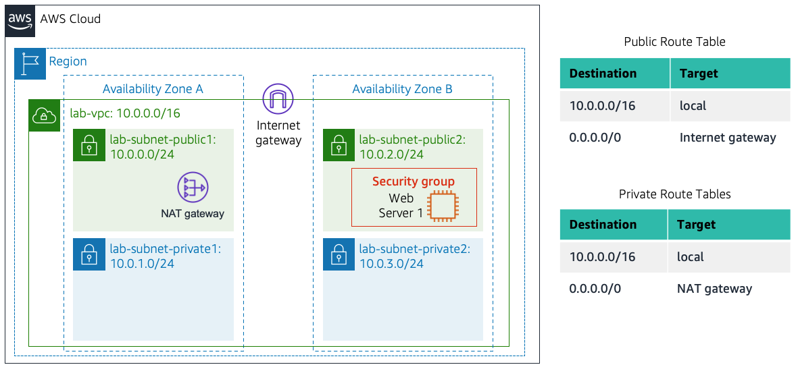
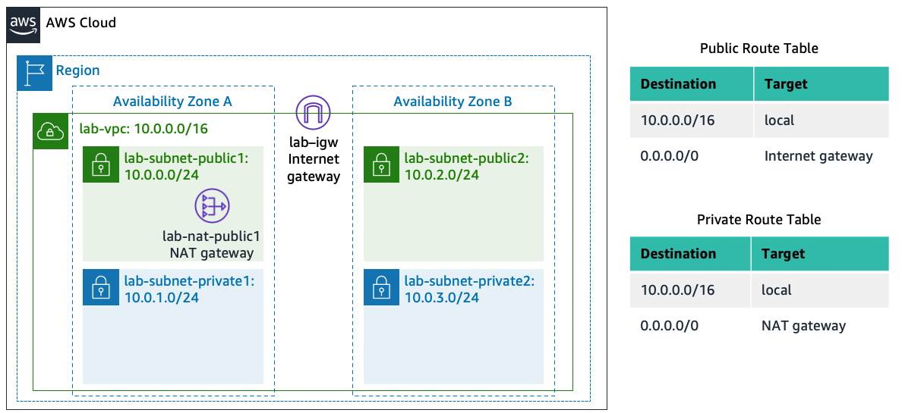

# Lab: Build your VPC and Launch a Web Server

## Lab overview and objectives

In this lab, you will use Amazon Virtual Private Cloud (VPC) to create your own VPC and add additional components to produce a customized network. You will also create a security group. You will then configure and customize an EC2 instance to run a web server and you will launch the EC2 instance to run in a subnet in the VPC.

__Amazon Virtual Private Cloud (Amazon VPC)__ enables you to launch Amazon Web Services (AWS) resources into a virtual network that you defined. This virtual network closely resembles a traditional network that you would operate in your own data center, with the benefits of using the scalable infrastructure of AWS. You can create a VPC that spans multiple Availability Zones.

After completing this lab, you should be able to do the following:

* Create a VPC.
* Create subnets.
* Configure a security group.
* Launch an EC2 instance into a VPC.


## Duration

This lab takes approximately __30 minutes__ to complete.


## AWS service restrictions

In this lab environment, access to AWS services and service actions might be restricted to the ones that are needed to complete the lab instructions. You might encounter errors if you attempt to access other services or perform actions beyond the ones that are described in this lab.

## Scenario

In this lab you build the following infrastructure:




## Accessing the AWS Management Console

1. At the top of these instructions, choose  __Start Lab__.

   *  The lab session starts.

   * A timer displays at the top of the page and shows the time remaining in the session.

     __Tip:__ To refresh the session length at any time, choose  __Start Lab__ again before the timer reaches 0:00.

   * Before you continue, wait until the circle icon to the right of the AWS  link in the upper-left corner turns green. 

2. To connect to the AWS Management Console, choose the __AWS__ link in the upper-left corner.

   * A new browser tab opens and connects you to the console.

     __Tip:__ If a new browser tab does not open, a banner or icon is usually at the top of your browser with the message that your browser is preventing the site from opening pop-up windows. Choose the banner or icon, and then choose __Allow pop-ups__.

3. Arrange the AWS Management Console tab so that it displays along side these instructions. Ideally, you will be able to see both browser tabs at the same time, to make it easier to follow the lab steps.


## Getting Credit for your work

At the end of this lab you will be instructed to submit the lab to receive a score based on your progress.

__Tip:__ The script that checks you works may only award points if you name resources and set configurations as specified. In particular, values in these instructions that appear in This Format should be entered exactly as documented (case-sensitive).


## Task 1: Create Your VPC

In this task, you will use the VPC and more option in the VPC console to create multiple resources, including a _VPC_, an _Internet Gateway_, a _public subnet_ and a _private subnet_ in a single Availability Zone, two route tables, and a _NAT Gateway_.

4. In the search box to the right of __Services__, search for and choose __VPC__ to open the VPC console.

5. Begin creating a VPC.

   * In the top right of the screen, verify that __N. Virginia (us-east-1)__ is the region. 

   * Choose the __VPC dashboard__ link which is towards the top left of the console.

   * Next, choose <span style="color:orange">Create VPC</span>. 

     __Note__: If you do not see a button with that name, choose the Launch VPC Wizard button instead.

6. Configure the VPC details in the _VPC settings_ panel on the left:

   * Choose __VPC and more__.

   * Under __Name tag auto-generation__, keep _Auto-generate_ selected, however change the value from project to lab.

   * Keep the __IPv4 CIDR block__ set to 10.0.0.0/16

   * For __Number of Availability Zones__, choose __1__.

   * For __Number of public subnets__, keep the __1__ setting.

   * For __Number of private subnets__, keep the __1__ setting.

   * Expand the __Customize subnets CIDR blocks__ section

      * Change __Public subnet CIDR block in us-east-1a__ to 10.0.0.0/24

      * Change __Private subnet CIDR block in us-east-1a__ to 10.0.1.0/24

   * Set __NAT gateways__ to In __1 AZ__.

   * Set __VPC endpoints__ to __None__.

   * Keep both __DNS hostnames__ and __DNS resolution__ enabled.

7. In the Preview panel on the right, confirm the settings you have configured.

   * __VPC:__ lab-vpc

   * __Subnets__:

      * us-east-1a

         * __Public subnet name:__ lab-subnet-public1-us-east-1a

         * __Private subnet name:__ lab-subnet-private1-us-east-1a

   * __Route tables__

      * lab-rtb-public

      * lab-rtb-private1-us-east-1a

   * __Network connections__

      * lab-igw

      * lab-nat-public1-us-east-1a 
 
8. At the bottom of the screen, choose <span style="color:orange">Create VPC</span>

   The VPC resources are created. The NAT Gateway will take a few minutes to activate. 

   Please wait until _all_ the resources are created before proceding to the next step.
 

9. Once it is complete, choose <span style="color:orange">View VPC</span>

   The wizard has provisioned a VPC with a public subnet and a private subnet in one Availability Zone with route tables for each subnet. It also created an Internet Gateway and a NAT Gateway. 

   To view the settings of these resources, browse through the VPC console links that display the resource details. For example, choose __Subnets__ to view the subnet details and choose __Route tables__ to view the route table details. The diagram below summarizes the VPC resources you have just created and how they are configured.

   

   An Internet gateway is a VPC resource that allows communication between EC2 instances in your VPC and the Internet. 

   The lab-subnet-public1-us-east-1a public subnet has a CIDR of __10.0.0.0/24__, which means that it contains all IP addresses starting with __10.0.0.x__. The fact the route table associated with this public subnet routes 0.0.0.0/0 network traffic to the internet gateway is what makes it a public subnet.

   A NAT Gateway, is a VPC resource used to provide internet connectivity to any EC2 instances running in private subnets in the VPC without those EC2 instances needing to have a direct connection to the internet gateway.

   The  lab-subnet-private1-us-east-1a private subnet has a CIDR of __10.0.1.0/24__, which means that it contains all IP addresses starting with __10.0.1.x__.


## Task 2: Create Additional Subnets

In this task, you will create two additional subnets for the VPC in a second Availability Zone. Having subnets in multiple Availability Zones within a VPC is useful for deploying solutions that provide _High Availability_. 

After creating a VPC as you have already done, you can still configure it further, for example, by adding more __subnets__. Each subnet you create resides entirely within one Availability Zone. 

 
10. In the left navigation pane, choose __Subnets__.

    First, you will create a second public subnet.

11. Choose <span style="color:orange">Create subnet</span> then configure:

    * __VPC ID:  lab-vpc__ (select from the menu).

    * __Subnet name:_ lab-subnet-public2

    * __Availability Zone:__ Select the second Availability Zone (for example, us-east-1b)

    * __IPv4 CIDR block:__ 10.0.2.0/24

    The subnet will have all IP addresses starting with __10.0.2.x__.

12. Choose <span style="color:orange">Create subnet</span>

    The second public subnet was created. You will now create a second private subnet.

13. Choose <span style="color:orange">Create subnet</span> then configure:

    * __VPC ID:__ lab-vpc

    * __Subnet name:__ lab-subnet-private2

    * __Availability Zone:__ Select the second Availability Zone (for example, us-east-1b)

    * __IPv4 CIDR block:__ 10.0.3.0/24

    The subnet will have all IP addresses starting with __10.0.3.x__.

14. Choose <span style="color:orange">Create subnet</span>

    The second private subnet was created. 

    You will now configure this new private subnet to route internet-bound traffic to the NAT Gateway so that resources in the second private subnet are able to connect to the Internet, while still keeping the resources private. This is done by configuring a Route Table.

    A route table contains a set of rules, called routes, that are used to determine where network traffic is directed. Each subnet in a VPC must be associated with a route table; the route table controls routing for the subnet.

15. In the left navigation pane, choose __Route tables__.

16. Select  the __lab-rtb-private1-us-east-1a__ route table.

17. In the lower pane, choose the __Routes__ tab.

    Note that __Destination 0.0.0.0/0__ is set to __Target nat-xxxxxxxx__. This means that traffic destined for the internet (0.0.0.0/0) will be sent to the NAT Gateway. The NAT Gateway will then forward the traffic to the internet.

    This route table is therefore being used to route traffic from private subnets. 

18. Choose the __Subnet associations__ tab.

    You created this route table in task 1 when you chose to create a VPC and multiple resources in the VPC. That action also created lab-subnet-private-1 and associated that subnet with this route table. 

    Now that you have created another private subnet, lab-subnet-private-2, you will associate this route table with that subnet as well.

19. In the Explicit subnet associations panel, choose Edit subnet associations

20. Leave __lab-subnet-private1-us-east-1a__ selected, but also select  __lab-subnet-private2__.

21. Choose <span style="color:orange">Save associations</span>

    You will now configure the Route Table that is used by the Public Subnets.

22. Select the __lab-rtb-public__ route table (and deselect any other subnets).

23. In the lower pane, choose the __Routes__ tab.

    Note that __Destination 0.0.0.0/0__ is set to __Target igw-xxxxxxxx__, which is an Internet Gateway. This means that internet-bound traffic will be sent straight to the internet via this Internet Gateway.

    You will now associate this route table to the second public subnet you created.

24. Choose the __Subnet associations__ tab.

25. In the Explicit subnet associations area, choose Edit subnet associations

26. Leave __lab-subnet-public1-us-east-1a__ selected, but also select  __lab-subnet-public2__.

27. Choose <span style="color:orange">Save associations</span>

    Your VPC now has public and private subnets configured in two Availability Zones. The route tables you created in task 1 have also been updated to route network traffic for the two new subnets.

    


## Task 3: Create a VPC Security Group

In this task, you will create a VPC security group, which acts as a virtual firewall. When you launch an instance, you associate one or more security groups with the instance. You can add rules to each security group that allow traffic to or from its associated instances.

28. In the left navigation pane, choose __Security groups__.

29. Choose <span style="color:orange">Create security group</span> and then configure:

    * __Security group name:__ Web Security Group

    * __Description:__ Enable HTTP access

    * __VPC:__ choose the X to remove the currently selected VPC, then from the drop down list choose __lab-vpc__

30. In the __Inbound rules__ pane, choose Add rule

31. Configure the following settings:

    * __Type:__ HTTP

    * __Source:__ Anywhere-IPv4

    * __Description:__ Permit web requests

32. Scroll to the bottom of the page and choose <span style="color:orange">Create security group</span>

    You will use this security group in the next task when launching an Amazon EC2 instance.

 
## Task 4: Launch a Web Server Instance

In this task, you will launch an Amazon EC2 instance into the new VPC. You will configure the instance to act as a web server.

33. In the search box to the right of  __Services__, search for and choose __EC2__ to open the EC2 console.

34. From the <span style="color:orange">Launch instance</span> menu choose __Launch instance__.

35. Name the instance:

    * Give it the name Web Server 1

      When you name your instance, AWS creates a tag and associates it with the instance. A tag is a key value pair. The key for this pair is __*Name*__, and the value is the name you enter for your EC2 instance.

36. Choose an AMI from which to create the instance:

    * In the list of available Quick Start AMIs, keep the default __Amazon Linux__ selected. 

    * Also keep the default __Amazon Linux 2023 AMI__ selected.

      The type of _Amazon Machine Image (AMI)_ you choose determines the Operating System that will run on the EC2 instance that you launch.

37. Choose an Instance type:

    * In the Instance type panel, keep the default __t2.micro__ selected.

      The Instance Type defines the hardware resources assigned to the instance.

38. Select the key pair to associate with the instance:

    * From the __Key pair name__ menu, select __vockey__.

      The vockey key pair you selected will allow you to connect to this instance via SSH after it has launched. Although you will not need to do that in this lab, it is still required to identify an existing key pair, or create a new one, or choose to proceed without a key pair, when you launch an instance.

39. Configure the Network settings:

    * Next to Network settings, choose __Edit__, then configure: 

      * __Network:__ lab-vpc 

      * __Subnet:__ lab-subnet-public2 (not Private!)

      * __Auto-assign public IP:__ Enable

    * Next, you will configure the instance to use the Web Security Group that you created earlier.

      * Under Firewall (security groups), choose  __Select existing security group__.

      * For __Common security groups__, select  __Web Security Group__.

        This security group will permit HTTP access to the instance.

40. In the Configure storage section, keep the default settings.

    __Note:__ The default settings specify that the root volume of the instance, which will host the Amazon Linux guest operating system that you specified earlier, will run on a general purpose SSD (gp3) hard drive that is 8 GiB in size. You could alternatively add more storage volumes, however that is not needed in this lab.

41. Configure a script to run on the instance when it launches: 

    * Expand the __Advanced details__ panel.

    * Scroll to the bottom of the page and then copy and paste the code shown below into the __User data__ box:

      ```bash
      #!/bin/bash
      # Install Apache Web Server and PHP
      dnf install -y httpd wget php mariadb105-server
      # Download Lab files
      wget https://aws-tc-largeobjects.s3.us-west-2.amazonaws.com/CUR-TF-100-ACCLFO-2/2-lab2-vpc/s3/lab-app.zip
      unzip lab-app.zip -d /var/www/html/
      # Turn on web server
      chkconfig httpd on
      service httpd start
      ```

      This script will run with root user permissions on the guest OS of the instance. It will run automatically when the instance launches for the first time. The script installs a web server, a database, and PHP libraries, and then it downloads and installs a PHP web application on the web server.

42. At the bottom of the __Summary__ panel on the right side of the screen choose <span style="color:orange">Launch instance</span>

    You will see a Success message.

43. Choose <span style="color:orange">View all instances</span>

44. Wait until __Web Server 1__ shows 2/2 checks passed in the __Status check__ column.

    This may take a few minutes. Choose the refresh  icon at the top of the page every 30 seconds or so to more quickly become aware of the latest status of the instance.

    You will now connect to the web server running on the EC2 instance.

45. Select  __Web Server 1__.

46. Copy the __Public IPv4 DNS__ value shown in the __Details__ tab at the bottom of the page.

47. Open a new web browser tab, paste the __Public DNS__ value and press Enter.

    You should see a web page displaying the AWS logo and instance meta-data values.

    The complete architecture you deployed is:

    
 

## Submitting your work

48. To record your progress, choose __Submit__ at the top of these instructions.

49. When prompted, choose __Yes__.

    After a couple of minutes, the grades panel appears and shows you how many points you earned for each task. If the results don't display after a couple of minutes, choose __Grades__ at the top of these instructions.

    __Tip:__ You can submit your work multiple times. After you change your work, choose Submit again. Your last submission is recorded for this lab.

50. To find detailed feedback about your work, choose __Submission Report__.

    __Tip:__ For any checks where you did not receive full points, there are sometimes helpful details provided in the submission report.

 
## Lab complete 

Congratulations! You have completed the lab.

51. Choose  __End Lab__ at the top of this page, and then select <span style="color:blue">Yes</span> to confirm that you want to end the lab.

    A panel indicates that You may close this message box now...

52. Select the __X__ in the top-right corner to close the panel.

 

© 2023, Amazon Web Services, Inc. and its affiliates. All rights reserved. This work may not be reproduced or redistributed, in whole or in part, without prior written permission from Amazon Web Services, Inc. Commercial copying, lending, or selling is prohibited.