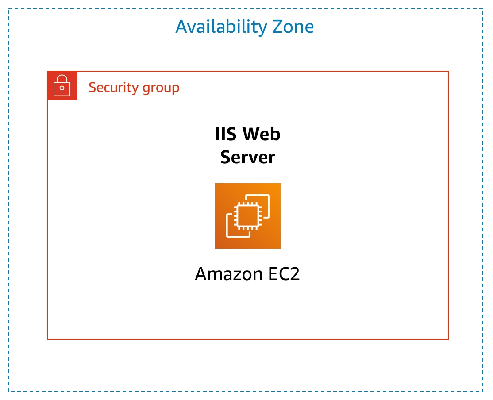
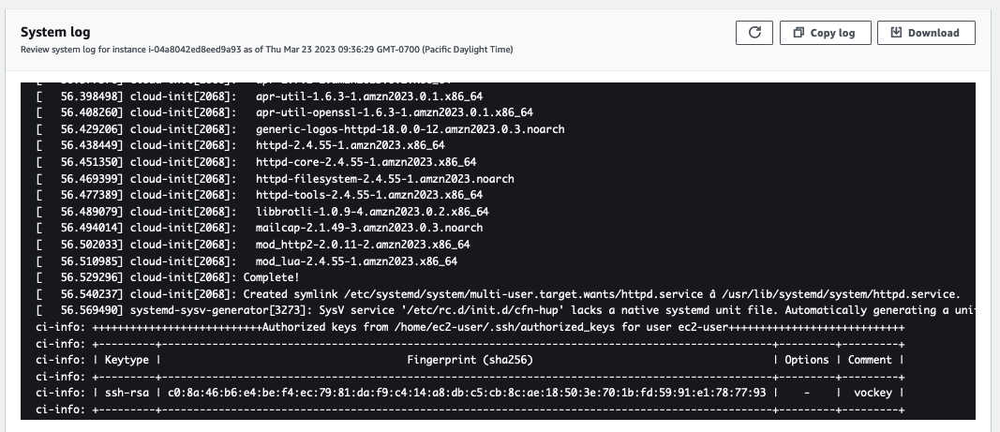
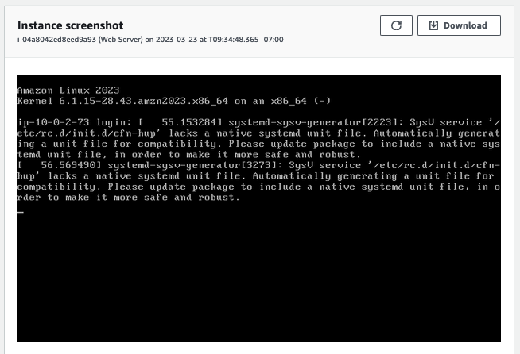

# Lab: Introduction to Amazon EC2
## Lab overview and objectives


 

This lab provides you with a basic overview of launching, resizing, managing, and monitoring an Amazon EC2 instance.

__Amazon Elastic Compute Cloud (Amazon EC2)__ is a web service that provides resizable compute capacity in the cloud. It is designed to make web-scale cloud computing easier for developers.

Amazon EC2's simple web service interface allows you to obtain and configure capacity with minimal friction. It provides you with complete control of your computing resources and lets you run on Amazon's proven computing environment. Amazon EC2 reduces the time required to obtain and boot new server instances to minutes, allowing you to quickly scale capacity, both up and down, as your computing requirements change.

Amazon EC2 changes the economics of computing by allowing you to pay only for capacity that you actually use. Amazon EC2 provides developers the tools to build failure resilient applications and isolate themselves from common failure scenarios.

 
After completing this lab, you should be able to do the following:

* Launch a web server with termination protection enabled

* Monitor Your EC2 instance

* Modify the security group that your web server is using to allow HTTP access

* Resize your Amazon EC2 instance to scale and enable stop protection

* Explore EC2 limits

* Test stop protection

* Stop your EC2 instance


## Duration
This lab takes approximately __35 minutes__ to complete.

 
## AWS service restrictions
In this lab environment, access to AWS services and service actions might be restricted to the ones that are needed to complete the lab instructions. You might encounter errors if you attempt to access other services or perform actions beyond the ones that are described in this lab.

 
## Accessing the AWS Management Console

1. At the top of these instructions, choose  Start Lab.

   * The lab session starts.

   * A timer displays at the top of the page and shows the time remaining in the session.

     __Tip:__ To refresh the session length at any time, choose __Start Lab__ again before the timer reaches 0:00.

   * Before you continue, wait until the circle icon to the right of the AWS  link in the upper-left corner turns green. 

2. To connect to the AWS Management Console, choose the AWS link in the upper-left corner.

   A new browser tab opens and connects you to the console.

   __Tip:__ If a new browser tab does not open, a banner or icon is usually at the top of your browser with the message that your browser is preventing the site from opening pop-up windows. Choose the banner or icon, and then choose __Allow pop-ups__.

3. Arrange the AWS Management Console tab so that it displays along side these instructions. Ideally, you will be able to see both browser tabs at the same time, to make it easier to follow the lab steps.

 
## Getting Credit for your work
At the end of this lab you will be instructed to submit the lab to receive a score based on your progress.

__Tip:__ The script that checks you works may only award points if you name resources and set configurations as specified. In particular, values in these instructions that appear in This Format should be entered exactly as documented (case-sensitive).

 
## Task 1: Launch Your Amazon EC2 Instance
In this task, you will launch an Amazon EC2 instance with termination protection and stop protection. Termination protection prevents you from accidentally terminating the EC2 instance and stop protection prevents you from accidentally stopping the EC2 instance. You will also specify a User Data script when you launch the instance that will deploy a simple web server.

4. In the __AWS Management Console__ choose  __Services__, choose __Compute__ and then choose __EC2__.

   __Note:__ Verify that your EC2 console is currently managing resources in the __N. Virginia__ (us-east-1) region.  You can verify this by looking at the drop down menu at the top of the screen, to the left of your username. If it does not already indicate N. Virginia, choose the N. Virginia region from the region menu before proceeding to the next step.

5. Choose the Launch instance  menu and select __Launch instance__.

 
### Step 1: Name and tags

6. Give the instance the name Web Server.

   The Name you give this instance will be stored as a tag. Tags enable you to categorize your AWS resources in different ways, for example, by purpose, owner, or environment. This is useful when you have many resources of the same type — you can quickly identify a specific resource based on the tags you have assigned to it. Each tag consists of a Key and a Value, both of which you define. You can define multiple tags to associate with the instance if you want to.

   In this case, the tag that will be created will consist of a key called Name with a value of Web Server

 
### Step 2: Application and OS Images (Amazon Machine Image)

7. In the list of available Quick Start AMIs, keep the default Amazon Linux AMI selected. 

8. Also keep the default __Amazon Linux 2023 AMI__ selected.

   An __Amazon Machine Image (AMI)__ provides the information required to launch an instance, which is a virtual server in the cloud. An AMI includes:

   * A template for the root volume for the instance (for example, an operating system or an application server with applications)

   * Launch permissions that control which AWS accounts can use the AMI to launch instances

   * A block device mapping that specifies the volumes to attach to the instance when it is launched

   The __Quick Start__ list contains the most commonly-used AMIs. You can also create your own AMI or select an AMI from the AWS Marketplace, an online store where you can sell or buy software that runs on AWS.

 
### Step 3: Instance type

9. In the Instance type panel, keep the default __t2.micro__ selected.

   Amazon EC2 provides a wide selection of instance types optimized to fit different use cases. Instance types comprise varying combinations of CPU, memory, storage, and networking capacity and give you the flexibility to choose the appropriate mix of resources for your applications. Each instance type includes one or more instance sizes, allowing you to scale your resources to the requirements of your target workload.

   The t2.micro instance type has 1 virtual CPU and 1 GiB of memory. 

   __Note:__ You may be restricted from using other instance types in this lab.


### Step 4: Key pair (login)

10. For __Key pair name - required__, choose __vockey__.

    Amazon EC2 uses public–key cryptography to encrypt and decrypt login information. To ensure you will be able to log in to the guest OS of the instance you create, you identify an existing key pair or create a new key pair when launching the instance. Amazon EC2 then installs the key on the guest OS when the instance is launched.  That way, when you attempt to login to the instance and you provide the private key, you will be authorized to connect to the instance.

    __Note:__ In this lab you will not actually use the key pair you have specified to log into your instance.

 
### Step 5: Network settings

11. Next to Network settings, choose __Edit__.

12. For __VPC__, select __Lab VPC__.

    The Lab VPC was created using an AWS CloudFormation template during the setup process of your lab. This VPC includes two public subnets in two different Availability Zones.

    __Note:__ Keep the default subnet __PublicSubnet1__. This is the subnet in which the instance will run. Notice also that by default, the instance will be assigned a public IP address.

13. Under __Firewall (security groups)__, choose __Create security group__ and configure:

    * __Security group name:__ Web Server security group

    * __Description:__ Security group for my web server

      A security group acts as a virtual firewall that controls the traffic for one or more instances. When you launch an instance, you associate one or more security groups with the instance. You add rules to each security group that allow traffic to or from its associated instances. You can modify the rules for a security group at any time; the new rules are automatically applied to all instances that are associated with the security group.

    * Under __Inbound security group rules__, notice that one rule exists. __Remove__ this rule.


### Step 6: Configure storage

14. In the Configure storage section, keep the default settings.

    Amazon EC2 stores data on a network-attached virtual disk called Elastic Block Store.

    You will launch the Amazon EC2 instance using a default 8 GiB disk volume. This will be your root volume (also known as a 'boot' volume).

 
### Step 7: Advanced details

15. Expand __Advanced details__.
 
16. For __Termination protection__, select __Enable__.

    When an Amazon EC2 instance is no longer required, it can be terminated, which means that the instance is deleted and its resources are released. A terminated instance cannot be accessed again and the data that was on it cannot be recovered. If you want to prevent the instance from being accidentally terminated, you can enable termination protection for the instance, which prevents it from being terminated as long as this setting remains enabled.

17. Scroll to the bottom of the page and then copy and paste the code shown below into the __User data__ box:

    ```bash
    #!/bin/bash
    dnf install -y httpd
    systemctl enable httpd
    systemctl start httpd
    echo '<html><h1>Hello From Your Web Server!</h1></html>' > /var/www/html/index.html
    ```

    When you launch an instance, you can pass user data to the instance that can be used to perform automated installation and configuration tasks after the instance starts.

    Your instance is running Amazon Linux 2023. The shell script you have specified will run as the root guest OS user when the instance starts. The script will:

    * Install an Apache web server (httpd)

    * Configure the web server to automatically start on boot

    * Run the Web server once it has finished installing

    * Create a simple web page

 
### Step 8: Launch the instance

18. At the bottom of the Summary panel choose Launch instance

    You will see a Success message.

 
19. Choose View all instances

    * In the Instances list, select  Web Server. 

    * Review the information displayed in the Details tab. It includes information about the instance type, security settings and network settings.

      The instance is assigned a Public IPv4 DNS that you can use to contact the instance from the Internet.

      To view more information, drag the window divider upwards.

      At first, the instance will appear in a Pending state, which means it is being launched. It will then change to Initializing, and finally to Running.

 
20. Wait for your instance to display the following:

    * __Instance State:__  Running

    * __Status Checks:__   2/2 checks passed

 
__Congratulations!__ You have successfully launched your first Amazon EC2 instance.

 
## Task 2: Monitor Your Instance

Monitoring is an important part of maintaining the reliability, availability, and performance of your Amazon Elastic Compute Cloud (Amazon EC2) instances and your AWS solutions.

21. Choose the Status checks tab.

    With instance status monitoring, you can quickly determine whether Amazon EC2 has detected any problems that might prevent your instances from running applications. Amazon EC2 performs automated checks on every running EC2 instance to identify hardware and software issues.

    Notice that both the __System reachability__ and __Instance reachability__ checks have passed.

 
22. Choose the __Monitoring__ tab.

    This tab displays Amazon CloudWatch metrics for your instance. Currently, there are not many metrics to display because the instance was recently launched.

    You can choose the three dots icon in any graph and select __Enlarge__ to see an expanded view of the chosen metric.

    Amazon EC2 sends metrics to Amazon CloudWatch for your EC2 instances. Basic (five-minute) monitoring is enabled by default. You can also enable detailed (one-minute) monitoring.

23. In the Actions  menu towards the top of the console, select __Monitor and troubleshoot  Get system log__.

    The System Log displays the console output of the instance, which is a valuable tool for problem diagnosis. It is especially useful for troubleshooting kernel problems and service configuration issues that could cause an instance to terminate or become unreachable before its SSH daemon can be started. If you do not see a system log, wait a few minutes and then try again.

24. Scroll through the output and note that the HTTP package was installed from the __user data__ that you added when you created the instance.

    

25. Choose __Cancel__.

26. Ensure __Web Server__ is still selected. Then, in the Actions  menu, select __Monitor and troubleshoot  Get instance screenshot__.

    This shows you what your Amazon EC2 instance console would look like if a screen were attached to it.

    

    If you are unable to reach your instance via SSH or RDP, you can capture a screenshot of your instance and view it as an image. This provides visibility as to the status of the instance, and allows for quicker troubleshooting.

27. Choose Cancel.

    __Congratulations!__ You have explored several ways to monitor your instance.

 

## Task 3: Update Your Security Group and Access the Web Server

When you launched the EC2 instance, you provided a script that installed a web server and created a simple web page. In this task, you will access content from the web server.

28. Ensure __Web Server__ is still selected.  Choose the __Details__ tab.

29. Copy the __Public IPv4 address__ of your instance to your clipboard.

30. Open a new tab in your web browser, paste the IP address you just copied, then press __Enter__.

    __Question:__ Are you able to access your web server? Why not?

    You are __not__ currently able to access your web server because the security group is not permitting inbound traffic on port 80, which is used for HTTP web requests. This is a demonstration of using a security group as a firewall to restrict the network traffic that is allowed in and out of an instance.

    To correct this, you will now update the security group to permit web traffic on port 80.

31. Keep the browser tab open, but return to the __EC2 Console__ tab.

32. In the left navigation pane, choose __Security Groups__.

33. Select  __Web Server security group__.

34. Choose the __Inbound rules__ tab.

    The security group currently has no inbound rules.

35. Choose Edit inbound rules, select Add rule and then configure:

    * __Type:__ HTTP

    * __Source:__ Anywhere-IPv4

    * Choose Save rules

36. Return to the web server tab that you previously opened and refresh  the page.

    You should see the message Hello From Your Web Server!

    __Congratulations!__ You have successfully modified your security group to permit HTTP traffic into your Amazon EC2 Instance.

 

## Task 4: Resize Your Instance: Instance Type and EBS Volume
As your needs change, you might find that your instance is over-utilized (too small) or under-utilized (too large). If so, you can change the instance type. For example, if a t2.micro instance is too small for its workload, you can change it to an m5.medium instance. Similarly, you can change the size of a disk.

 
### Stop Your Instance
Before you can resize an instance, you must stop it.

When you stop an instance, it is shut down. There is no runtime charge for a stopped EC2 instance, but the storage charge for attached Amazon EBS volumes remains.

37. On the __EC2 Management Console__, in the left navigation pane, choose __Instances__ and then select the  __Web Server__ instance.

38. In the Instance state  menu, select __Stop instance__.

39. Choose Stop

    Your instance will perform a normal shutdown and then will stop running.

40. Wait for the __Instance state__ to display:  Stopped.

 
### Change The Instance Type and enable stop protection

41. Select the Web Server instance, then in the Actions  menu, select __Instance settings  Change instance type__, then configure:

    * __Instance Type:__ t2.small

    * Choose Apply

    When the instance is started again it will run as a t2.small, which has twice as much memory as a t2.micro instance. __NOTE:__ You may be restricted from using other instance types in this lab.

 
42. Select the Web Server instance, then in the Actions  menu, select __Instance settings   Change stop protection__. Select __Enable__ and then Save the change.

    When you stop an instance, the instance shuts down. When you later start the instance, it is typically migrated to a new underlying host computer and assigned a new public IPv4 address. An instance retains its assigned private IPv4 address. When you stop an instance, it is not deleted. Any EBS volumes and the data on those volumes are retained. 

 

### Resize the EBS Volume

43. With the Web Server instance still selected, choose the __Storage__ tab, select the name of the Volume ID, then select the checkbox next to the volume that displays.

44. In the Actions  menu, select __Modify volume__.

    The disk volume currently has a size of 8 GiB. You will now increase the size of this disk.

45. Change the size to: 10 __NOTE__: You may be restricted from creating Amazon EBS volumes larger than 10 GB in this lab.

46. Choose __Modify__

47. Choose Modify again to confirm and increase the size of the volume.


### Start the Resized Instance

You will now start the instance again, which will now have more memory and more disk space.

48. In left navigation pane, choose __Instances__.

49. Select the __Web Server__ instance.

50. In the Instance state  menu, select __Start instance__.

    __Congratulations!__ You have successfully resized your Amazon EC2 Instance. In this task you changed your instance type from t2.micro to t2.small. You also modified your root disk volume from 8 GiB to 10 GiB.

 
## Task 5: Explore EC2 Limits

Amazon EC2 provides different resources that you can use. These resources include images, instances, volumes, and snapshots. When you create an AWS account, there are default limits on these resources on a per-region basis.

51. In the AWS Management Console, in the search box next to  __Services__, search for and choose Service Quotas

52. Choose __AWS services__ from the navigation menu and then in the AWS services Find services search bar, search for ec2 and choose __Amazon Elastic Compute Cloud (Amazon EC2)__.

53. In the Find quotas search bar, search for running on-demand, but do not make a selection. Instead, observe the filtered list of service quotas that match the criteria.

    Notice that there are limits on the number and types of instances that can run in a region. For example, there is a limit on the number of Running On-Demand Standard... instances that you can launch in this region. When launching instances, the request must not cause your usage to exceed the instance limits currently defined in that region.

    If you are the AWS account owner, you can request an increase for many of these limits.


## Task 6: Test Stop Protection

You can stop your instance when you do not need to access but you would still like to retain it. In this task, you will learn how to use stop protection.


54. In the AWS Management Console, in the search box next to  __Services__, search for and choose EC2 to return to the EC2 console.

55. In left navigation pane, choose __Instances__.

56. Select the __Web Server__ instance and in the Instance state  menu, select __Stop instance__.

57. Then choose Stop

    Note that there is a message that says: Failed to stop the instance i-1234567xxx. The instance 'i-1234567xxx' may not be stopped. Modify its 'disableApiStop' instance attribute and try again.

    This shows that the stop protection that you enabled earlier in this lab is now providing a safeguard to prevent the accidental stopping of an instance. If you really want to stop the instance, you will need to disable the stop protection.

58. In the Actions  menu, select __Instance settings  Change stop protection__.

59. Remove the check next to  __Enable__.

60. Choose Save

    You can now stop the instance.

61. Select the __Web Server__ instance again and in the Instance state  menu, select __Stop instance__.

62. Choose Stop

    __Congratulations!__ You have successfully tested stop protection and stopped your instance.


## Submitting your work

63. To record your progress, choose __Submit__ at the top of these instructions.

64. When prompted, choose __Yes__.

    After a couple of minutes, the grades panel appears and shows you how many points you earned for each task. If the results don't display after a couple of minutes, choose __Grades__ at the top of these instructions.

    __Important:__  Some of the checks made by the submission process in this lab will only give you credit if it has been at least 5 minutes since you completed the action. If you do not receive credit the first time you submit, you may need to wait a couple minutes and the submit again to receive credit for these items.

    __Tip:__ You can submit your work multiple times. After you change your work, choose __Submit__ again. Your last submission is recorded for this lab.

65. To find detailed feedback about your work, choose __Submission Report__.

    __Tip:__ For any checks where you did not receive full points, there are sometimes helpful details provided in the submission report.


## Lab Complete
Congratulations! You have completed the lab.

66. Choose End Lab at the top of this page and then choose Yes to confirm that you want to end the lab.  

    An End Lab panel will appear, indicating that "You may close this message box now."

67. Choose the __X__ in the top right corner to close the panel.

 

## Additional Resources

* Launch Your Instance https://docs.aws.amazon.com/AWSEC2/latest/UserGuide/LaunchingAndUsingInstances.html

* Amazon EC2 Instance Types https://aws.amazon.com/ec2/instance-types

* Amazon Machine Images (AMI) https://docs.aws.amazon.com/AWSEC2/latest/UserGuide/AMIs.html

* Amazon EC2 - User Data and Shell Scripts https://docs.aws.amazon.com/AWSEC2/latest/UserGuide/user-data.html

* Amazon EC2 Root Device Volume https://docs.aws.amazon.com/AWSEC2/latest/UserGuide/RootDeviceStorage.html

* Tagging Your Amazon EC2 Resources https://docs.aws.amazon.com/AWSEC2/latest/UserGuide/Using_Tags.html

* Security Groups https://docs.aws.amazon.com/AWSEC2/latest/UserGuide/using-network-security.html

* Amazon EC2 Key Pairs https://docs.aws.amazon.com/AWSEC2/latest/UserGuide/ec2-key-pairs.html

* Status Checks for Your Instances https://docs.aws.amazon.com/AWSEC2/latest/UserGuide/monitoring-system-instance-status-check.html?icmpid=docs_ec2_console

* Getting Console Output and Rebooting Instances https://docs.aws.amazon.com/AWSEC2/latest/UserGuide/instance-console.html

* Amazon EC2 Metrics and Dimensions https://docs.aws.amazon.com/AmazonCloudWatch/latest/monitoring/ec2-metricscollected.html

* Resizing Your Instance https://docs.aws.amazon.com/AWSEC2/latest/UserGuide/ec2-instance-resize.html

* Stop and Start Your Instance https://docs.aws.amazon.com/AWSEC2/latest/UserGuide/Stop_Start.html

* Amazon EC2 Service Limits https://docs.aws.amazon.com/AWSEC2/latest/UserGuide/ec2-resource-limits.html

* Terminate Your Instance https://docs.aws.amazon.com/AWSEC2/latest/UserGuide/terminating-instances.html

* Termination Protection for an Instance https://docs.aws.amazon.com/AWSEC2/latest/UserGuide/terminating-instances.html

 

© 2023, Amazon Web Services, Inc. and its affiliates. All rights reserved. This work may not be reproduced or redistributed, in whole or in part, without prior written permission from Amazon Web Services, Inc. Commercial copying, lending, or selling is prohibited.