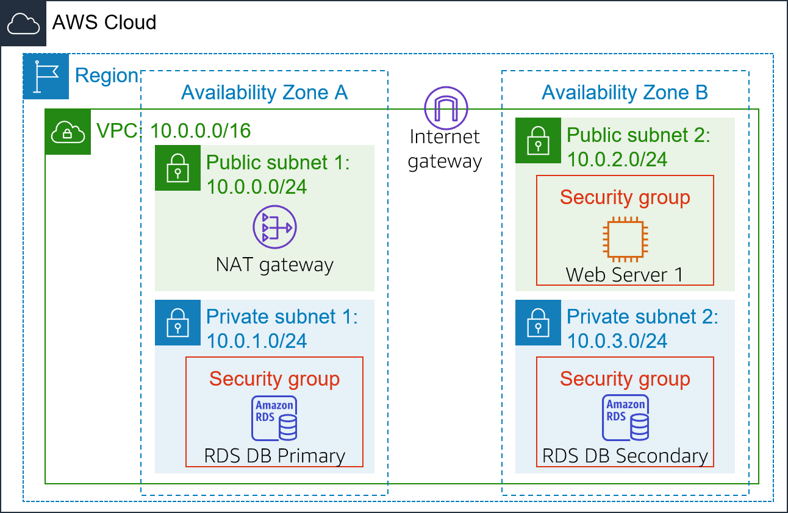
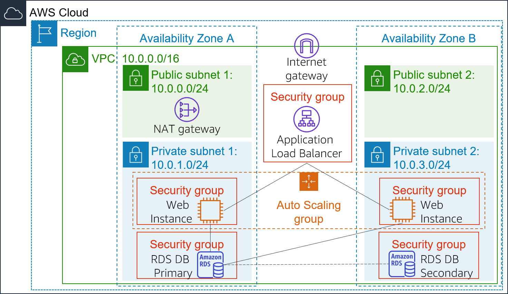

# Lab 6: Scale and Load Balance Your Architecture

## Lab Overview and objectives

This lab walks you through using the Elastic Load Balancing (ELB) and Auto Scaling services to load balance and automatically scale your infrastructure.

__Elastic Load Balancing__ automatically distributes incoming application traffic across multiple Amazon EC2 instances. It enables you to achieve fault tolerance in your applications by seamlessly providing the required amount of load balancing capacity needed to route application traffic.

__Auto Scaling__ helps you maintain application availability and allows you to scale your Amazon EC2 capacity out or in automatically according to conditions you define. You can use Auto Scaling to help ensure that you are running your desired number of Amazon EC2 instances. Auto Scaling can also automatically increase the number of Amazon EC2 instances during demand spikes to maintain performance and decrease capacity during lulls to reduce costs. Auto Scaling is well suited to applications that have stable demand patterns or that experience hourly, daily, or weekly variability in usage.  

By the end of this lab, you will be able to:

* Create an Amazon Machine Image (AMI) from a running instance.

* Create a load balancer.

* Create a launch template and an Auto Scaling group.

* Automatically scale new instances 

* Create Amazon CloudWatch alarms and monitor performance of your infrastructure.

## Duration

This lab takes approximately __30 minutes__.

 
## AWS service restrictions

In this lab environment, access to AWS services and service actions might be restricted to the ones that are needed to complete the lab instructions. You might encounter errors if you attempt to access other services or perform actions beyond the ones that are described in this lab.

__Caution:__ Any attempt to have 20 or more concurrently running instances (regardless of size), will result in immediate deactivation of the AWS account and all resources in the account will be immediately deleted.

## Scenario

You start with the following infrastructure:

The final state of the infrastructure is:

 
## Accessing the AWS Management Console

1. At the top of these instructions, choose  Start Lab.

   * The lab session starts.

   * A timer displays at the top of the page and shows the time remaining in the session.

     __Tip:__ To refresh the session length at any time, choose  __Start Lab__ again before the timer reaches 0:00.

   * Before you continue, wait until the circle icon to the right of the AWS  link in the upper-left corner turns green. 

 
2. To connect to the AWS Management Console, choose the AWS link in the upper-left corner.

   * A new browser tab opens and connects you to the console.

     __Tip:__ If a new browser tab does not open, a banner or icon is usually at the top of your browser with the message that your browser is preventing the site from opening pop-up windows. Choose the banner or icon, and then choose __Allow pop-ups__.

 
3. Arrange the AWS Management Console tab so that it displays along side these instructions. Ideally, you will be able to see both browser tabs at the same time, to make it easier to follow the lab steps.

 
## Getting Credit for your work

At the end of this lab you will be instructed to submit the lab to receive a score based on your progress. 

__Tip:__ The script that checks you works may only award points if you name resources and set configurations as specified. In particular, values in these instructions that appear in This Format should be entered exactly as documented (case-sensitive).

 
## Task 1: Create an AMI for Auto Scaling

In this task, you will create an AMI from the existing Web Server 1. This will save the contents of the boot disk so that new instances can be launched with identical content.

4. In the AWS Management Console, in the search box next to Services, search for and select EC2.

5. In the left navigation pane, choose Instances.

   First, you will confirm that the instance is running.

6. Wait until the __Status Checks__ for __Web Server 1__ displays 2/2 checks passed. If necessary, choose refresh  to update the status.

   You will now create an AMI based upon this instance.

7. Select  __Web Server 1__.

8. In the Actions  menu, choose __Image and templates > Create image__, then configure:

   * __Image name:__ WebServerAMI

   * __Image description:__ Lab AMI for Web Server

9. Choose Create image

   A confirmation banner displays the __AMI ID__ for your new AMI.

   You will use this AMI when launching the Auto Scaling group later in the lab.

 
## Task 2: Create a Load Balancer

In this task, you will first create a target group and then you will create a load balancer that can balance traffic across multiple EC2 instances and Availability Zones.

10. In the left navigation pane, choose __Target Groups__.

    __Analysis:__ Target Groups define where to send traffic that comes into the Load Balancer. The Application Load Balancer can send traffic to multiple Target Groups based upon the URL of the incoming request, such as having requests from mobile apps going to a different set of servers. Your web application will use only one Target Group.

    * Choose Create target group

    * Choose a target type: __Instances__

    * __Target group name__, enter: LabGroup

    * Select __Lab VPC__ from the __VPC__ drop-down menu.

11. Choose Next. The __Register targets__ screen appears.

    Note: Targets are the individual instances that will respond to requests from the Load Balancer.

    You do not have any web application instances yet, so you can skip this step.

12. Review the settings and choose Create target group

13. In the left navigation pane, choose __Load Balancers__.

14. At the top of the screen, choose Create load balancer.

    Several different types of load balancer are displayed. You will be using an Application Load Balancer that operates at the request level (layer 7), routing traffic to targets — EC2 instances, containers, IP addresses and Lambda functions — based on the content of the request. For more information, see: Comparison of Load Balancers

15. Under __Application Load Balancer__, choose __Create__

16. Under __Load balancer name__, enter: LabELB

17. Scroll down to the __Network mapping__ section, then:

    * For __VPC__, choose __Lab VPC__

    * You will now specify which subnets the Load Balancer should use. The load balancer will be internet facing, so you will select both Public Subnets.

    * Choose the __first__ displayed Availability Zone, then select __Public Subnet 1__ from the Subnet drop down menu that displays beneath it.

    * Choose the __second__ displayed Availability Zone, then select __Public Subnet 2__ from the Subnet drop down menu that displays beneath it.

    * You should now have two subnets selected: __Public Subnet 1__ and __Public Subnet 2__. 

18. In the __Security groups__ section:

    * Choose the Security groups drop down menu and select  __Web Security Group__

    * Below the drop down menu, choose the __X__ next to the default security group to remove it.

      The __Web Security Group__ security group should now be the only one that appears.

19. For the Listener HTTP:80 row, set the Default action to forward to __LabGroup__.

20. Scroll to the bottom and choose Create load balancer

    The load balancer is successfully created.

    * Choose View load balancer

      The load balancer will show a state of provisioning. There is no need to wait until it is ready. Please continue with the next task.

 

## Task 3: Create a Launch Template and an Auto Scaling Group

In this task, you will create a launch template for your Auto Scaling group. A launch template is a template that an Auto Scaling group uses to launch EC2 instances. When you create a launch template, you specify information for the instances such as the AMI, the instance type, a key pair, and security group.

 
21. In the left navigation pane, choose __Launch Templates__.

22. Choose Create launch template

23. Configure the launch template settings and create it:

    * __Launch template name__: LabConfig

    * Under __Auto Scaling guidance__, select  Provide guidance to help me set up a template that I can use with EC2 Auto Scaling

    * In the Application and OS Images (Amazon Machine Image) area, choose My AMIs.

    * __Amazon Machine Image (AMI)__: choose Web Server AMI

    * __Instance type__: choose t2.micro

    * __Key pair name__: choose vockey

    * __Firewall (security groups)__: choose Select existing security group

    * __Security groups__: choose   Web Security Group

    * Scroll down to the __Advanced details__ area and expand it.

    * Scroll down to the __Detailed CloudWatch monitoring__ setting. Select  Enable

      Note: This will allow Auto Scaling to react quickly to changing utilization.

    * Choose Create launch template

      Next, you will create an Auto Scaling group that uses this launch template.

24. In the Success dialog, choose the __LabConfig__ launch template.

25. From the __Actions__ menu, choose Create Auto Scaling group

26. Configure the details in Step 1 (Choose launch template or configuration):

    * __Auto Scaling group name__: Lab Auto Scaling Group

    * __Launch template__: confirm that the LabConfig template you just created is selected.

    * Choose Next

27. Configure the details in Step 2 (Choose instance launch options):

    * __VPC__: choose _Lab VPC_

    * __Availability Zones and subnets__: Choose Private Subnet 1 and then choose Private Subnet 2.

    * Choose Next

28. Configure the details in Step 3 (Configure advanced options):

    * Choose __Attach to an existing load balancer__

      * __Existing load balancer target groups__: select LabGroup.

    * In the __Additional settings__ pane:

      * Select __Enable group metrics collection within CloudWatch__

      This will capture metrics at 1-minute intervals, which allows Auto Scaling to react quickly to changing usage patterns.

    * Choose Next

29. Configure the details in Step 4 (Configure group size and scaling policies - optional):

    * Under __Group size__, configure: 

      * __Desired capacity__: 2

      * __Minimum capacity__: 2

      * __Maximum capacity__: 6

        This will allow Auto Scaling to automatically add/remove instances, always keeping between 2 and 6 instances running.

    * Under __Scaling policies__, choose Target tracking scaling policy and configure:

      * __Scaling policy name__: LabScalingPolicy

      * __Metric type__: Average CPU Utilization

      * __Target value__: 60

        This tells Auto Scaling to maintain an average CPU utilization across all instances at 60%. Auto Scaling will automatically add or remove capacity as required to keep the metric at, or close to, the specified target value. It adjusts to fluctuations in the metric due to a fluctuating load pattern.

    * Choose Next

30. Configure the details in Step 5 (Add notifications - optional):

    Auto Scaling can send a notification when a scaling event takes place. You will use the default settings.

    * Choose Next

31. Configure the details in Step 6 (Add tags - optional):

    Tags applied to the Auto Scaling group will be automatically propagated to the instances that are launched.

    * Choose Add tag and Configure the following:

      * __Key__: Name

      * __Value__: Lab Instance

    * Choose Next

32. Configure the details in Step 6 (Review):

    * Review the details of your Auto Scaling group

    * Choose Create Auto Scaling group

      Your Auto Scaling group will initially show an instance count of zero, but new instances will be launched to reach the __Desired__ count of 2 instances.

 
## Task 4: Verify that Load Balancing is Working

In this task, you will verify that Load Balancing is working correctly.

33. In the left navigation pane, choose __Instances__.

    You should see two new instances named __Lab Instance__. These were launched by Auto Scaling.

    If the instances or names are not displayed, wait 30 seconds and choose refresh  in the top-right.

    Next, you will confirm that the new instances have passed their Health Check.

34. In the left navigation pane, choose __Target Groups__.

35. Select _LabGroup_

36. Choose the __Targets__ tab.

    Two target instances named Lab Instance should be listed in the target group.

37. Wait until the __Status__ of both instances transitions to healthy. 

    Choose Refresh  in the upper-right to check for updates if necessary.

    Healthy indicates that an instance has passed the Load Balancer's health check. This means that the Load Balancer will send traffic to the instance.

    You can now access the Auto Scaling group via the Load Balancer.

38. In the left navigation pane, choose __Load Balancers__.

39. Select the  LabELB load balancer.

40. In the Details pane, copy the __DNS name__ of the load balancer, making sure to omit "(A Record)".

    It should look similar to: _LabELB-1998580470.us-west-2.elb.amazonaws.com_

41. Open a new web browser tab, paste the DNS Name you just copied, and press Enter.

    The application should appear in your browser. This indicates that the Load Balancer received the request, sent it to one of the EC2 instances, then passed back the result.

 
## Task 5: Test Auto Scaling

You created an Auto Scaling group with a minimum of two instances and a maximum of six instances. Currently two instances are running because the minimum size is two and the group is currently not under any load. You will now increase the load to cause Auto Scaling to add additional instances.

42. Return to the AWS Management Console, but do not close the application tab — you will return to it soon.

43. in the search box next to  Services , search for and select __CloudWatch__.

44. In the left navigation pane, choose __All alarms__.

    Two alarms will be displayed. These were created automatically by the Auto Scaling group. They will automatically keep the average CPU load close to 60% while also staying within the limitation of having two to six instances.

    __Note__: Please follow these steps only if you do not see the alarms in 60 seconds.

    * On the  Services  menu, choose __EC2__.

    * In the left navigation pane, choose __Auto Scaling Groups__. 

    * Select  __Lab Auto Scaling Group__.

    * In the bottom half of the page, choose the __Automatic Scaling__ tab.

    * Select  __LabScalingPolicy__.

    * Choose __Actions__  and __Edit__.

    * Change the __Target Value__ to 50.

    * Choose Update

    * On the Services  menu, choose __CloudWatch__.

    * In the left navigation pane, choose __All alarms__ and verify you see two alarms.

45. Choose the __OK__ alarm, which has AlarmHigh in its name.

    If no alarm is showing __OK__, wait a minute then choose refresh  in the top-right until the alarm status changes.

    The __OK__ indicates that the alarm has not been triggered. It is the alarm for __CPU Utilization > 60__, which will add instances when average CPU is high. The chart should show very low levels of CPU at the moment.

    You will now tell the application to perform calculations that should raise the CPU level.

46. Return to the browser tab with the web application.

47. Choose __Load Test__ beside the AWS logo.

    This will cause the application to generate high loads. The browser page will automatically refresh so that all instances in the Auto Scaling group will generate load. Do not close this tab.

48. Return to browser tab with the __CloudWatch__ console.

    In less than 5 minutes, the __AlarmLow__ alarm should change to __OK__ and the __AlarmHigh__ alarm status should change to In alarm.

    You can choose Refresh  in the top-right every 60 seconds to update the display.

    You should see the __AlarmHigh__ chart indicating an increasing CPU percentage. Once it crosses the 60% line for more than 3 minutes, it will trigger Auto Scaling to add additional instances.

49. Wait until the __AlarmHigh__ alarm enters the In alarm state.

    You can now view the additional instance(s) that were launched.

50. In the search box next to  Services , search for and select __EC2__.

51. In the left navigation pane, choose __Instances__.

    More than two instances labeled __Lab Instance__ should now be running. The new instance(s) were created by Auto Scaling in response to the CloudWatch alarm.

## Task 6: Terminate Web Server 1

In this task, you will terminate Web Server 1. This instance was used to create the AMI used by your Auto Scaling group, but it is no longer needed.

52. Select  __Web Server 1__ (and ensure it is the only instance selected).

53. In the __Instance state__  menu, choose __Instance State > Terminate Instance__.

54. Choose Terminate

 
## Submitting your work

55. To record your progress, choose __Submit__ at the top of these instructions.

56. When prompted, choose __Yes__.

    After a couple of minutes, the grades panel appears and shows you how many points you earned for each task. If the results don't display after a couple of minutes, choose __Grades__ at the top of these instructions.

    __Tip__: You can submit your work multiple times. After you change your work, choose __Submit__ again. Your last submission is recorded for this lab.

57. To find detailed feedback about your work, choose __Submission Report__.

    __Tip__: For any checks where you did not receive full points, there are sometimes helpful details provided in the submission report.

 
## Lab Complete

Congratulations! You have completed the lab.

58. Choose __End Lab__ at the top of this page and then choose Yes to confirm that you want to end the lab.  

    A panel will appear, indicating that "DELETE has been initiated... You may close this message box now."

59. Choose the __X__ in the top right corner to close the panel.

 

©2023 Amazon Web Services, Inc. and its affiliates. All rights reserved. This work may not be reproduced or redistributed, in whole or in part, without prior written permission from Amazon Web Services, Inc. Commercial copying, lending, or selling is prohibited.