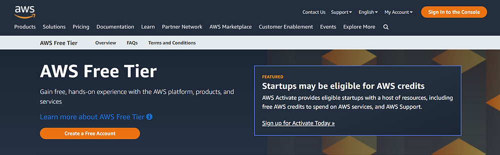
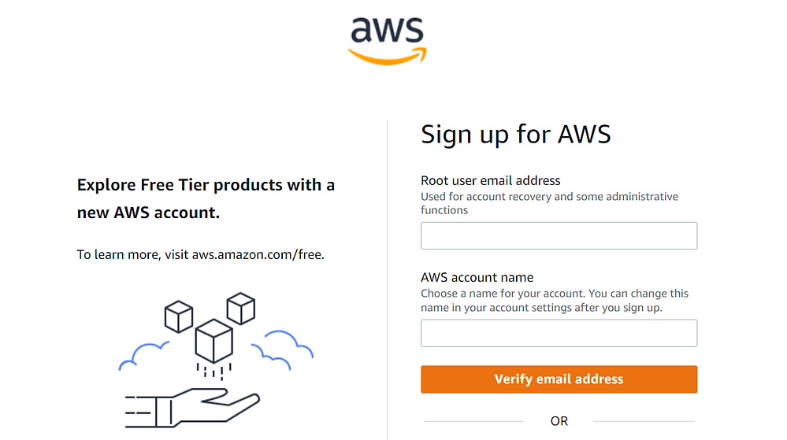
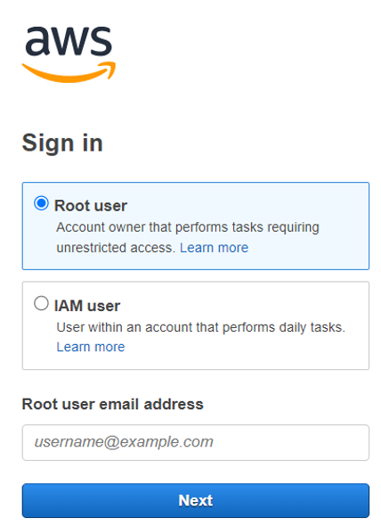

# What is Amazon Web Services (AWS)
Amazon Web Services or AWS as it’s commonly known in the tech industry is the world’s most reliable cloud computing platform. It provides hundreds of unique services which are all cloud-based, ranging from databases to virtual servers.

# Create an AWS account

## Step 1:
Click on the following URL:

https://aws.amazon.com/free/

## Step 2:
Please proceed to __create a free account__.

## Step 3:
Please enter your email address as the root user email address. After that you must decide on your AWS account name and verify your email address.

## Step 4:
After you have verified your email address you will be asked to enter additional details.

- First of all, you must complete a general sign-up form which will ask you to enter in a few details, such as your name, address, country etc.

- You must then put a card on file. After you have put your credit card on file you will be charged $1, and then you will be refunded a few minutes after. The point of this is to ensure that you have a working debit/credit card.

- You may be asked later in the set-up process to enter a verification code from your phone.

- Near the end of this process, please be sure to select the free plan.

## Step 5:
Once you have set-up your account, you may now login to AWS account with your root user account.

## Step 6:
Upon signing into your AWS account, you will be greeted with the AWS Management Console - and that's that!