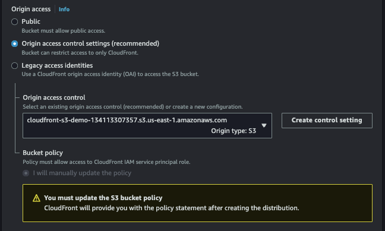
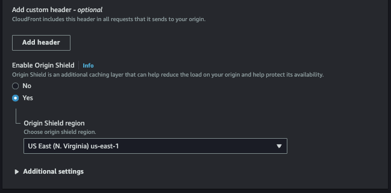

# Host Static WebSite on AWS S3 & CloudFront

    

    

## Step 1 - Sign in to AWS management console

1. Log in en la consola de administración de AWS y selecciona la región apropiada. Ej: us-east-1

## Step 2 - Create an S3 Bucket

1. Navega al servicio de S3

2. Click sobre **Create Bucket** e ingresa un nombre único para el bucket.

3. Selecciona la región.

    

4. Configura el Object Ownership y mantener ACLs disabled.

    

5. Block all public access - Esto provee una capa adicional de seguridad para los datos, previniendo acceso no autorizado y asegurando que los datos están protegidos todo el tiempo.

    

6. Dejar las otras opciones de forma predeterminada y click en "Create bucket" a crear el bucket.

## Step 3 - Upload file on S3 Bucket

1. Selecciona el bucket creado desde el dashboard.

2. Ir al tab **Objects** y click sobre **Upload**

3. Click en **Add files**

4. Ubicar, seleccionar el archivo y click en **Open**

5. Click en el botón **Upload**

    

## Step 4 - Create the Cloudfront distribution for S3 bucket

1. Ir a la consola de CloudFront.

2. Click en el botón **Create distribution**. Se mostrará la página de inicio.

3. Selecciona el **Origin domain** del bucket desde la lista desplegable (cloudfront-s3-demo-origin-134113307357).

3. Ingresa el nombre (**name**) del cloudfront distribution

    

4. Set the **origin access** as **Origin access control settings**.

    

5. We also need to create the ***access control setting*** for this cloudfront distro like below:

    

6. **Enable the Shield** as it helps to minimize your origin's load, improve its availability, and reduce its operating cost.

    

7. In **Default cache behaviour** settings set configuration as below, else keep it default.

    

8. Let **Function associations - optional** be as *default* for now.

    

9. En la sección **Web Application Firewal (WAF)** selecciona si desea habilitar o no la protección de seguridad.

    

10. En **Price class** selecciona la opción **Use all edge locations (best performance)**

11. Selecciona **HTTP/2** y **HTP/3** para **Supported HTTP versions**

12. Set **Default root object** como ***index.html***

13. Cambia **Standard logging** a ***On***

14. Selecciona [logBucket] (cloudfront-s3-demo-logbucket-134113307357) como **S3 bucket**

15. Ingresa *This Cloudfront distribution is for cloudfront-s3-demo-origin-134113307357 Bucket* en **Description**

16. Click en **Create distribution**

    

17. Una vez creada la distribución Cloudfront se debe agregar la politica dada en la respectiva politica del bucket S3. Copie la politica del bucket desde aquí.

    

## Step 5 - Configure the S3 Bucket

1. Selecciona el bucket creado desde el dashboard.

2. Ir al bucket S3 y seleccionar el tab "Permissions"

3. Click sobre "Bucket Policy" y pegar la politica copiada en el paso anterior, la cual, permite acceso al contenido del bucket.

    

4. Save the policy.

## Step 6 - Test Your App

1. Accediendo a la URL ***https://distribution-domain-name/s3-object-name***, retornará algo como esto:

    

## Referencias

https://catalog.us-east-1.prod.workshops.aws/workshops/4557215e-2a5c-4522-a69b-8d058aba088c/en-US